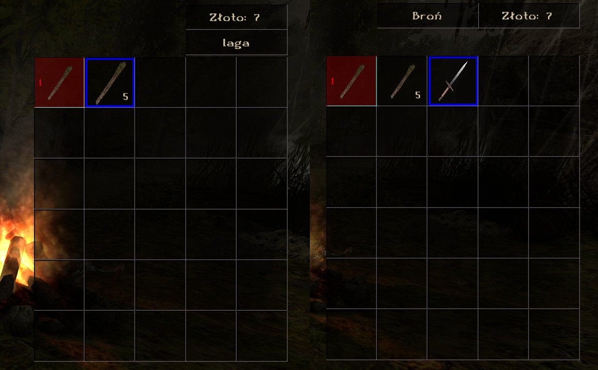

# CatInv-Union [Gothic 2 NotR]



A Union port of the popular CatInv (Category Inventory) plugin for Gothic II NotR, originally created by szapp (Sören Zapp) - visit [szapp's CatInv repository](https://github.com/szapp/CatInv) for the original Ninja version.
CatInv adds inventory categorization to Gothic II NotR, allowing players to filter items by type (weapons, armor, potions, etc.) for better inventory management. The main goal of the project is to eliminate the need for Ninja extension.

## Features

- **9 Item Categories**: All, Weapons, Armor, Magic, Artifacts, Food, Potions, Writings, Miscellaneous
- **Item Search**: Real-time search by item name with SHIFT+F
- **Keyboard Navigation**: Use SHIFT + Arrow Keys to switch between categories
- **Visual Category Display**: Shows current category name next to the gold counter
- **Full Container Support**: Works with player inventory, chests, trade, and dead NPCs
- **Localization Support**: Automatically uses game language for category names
- **Gothic II Compatible**: Supports both Gothic II Classic and NotR

## Installation

1. Download the latest release from the [Releases](../../releases) page
2. Extract `CatInv.vdf` to your `Gothic II\Data\Plugins` folder
3. Launch Gothic II - the plugin will load automatically

## Usage

### Basic Controls
- **SHIFT + ←/→**: Switch between categories
- **SHIFT + Home**: Jump to first category
- **SHIFT + End**: Jump to last category
- **Home**: Jump to first item in current category/search results
- **End**: Jump to last item in current category/search results
- **SHIFT + F**: Activate item search
  - Type to search for items by name
  - **Enter**: Confirm search (allows navigation with arrows/Home/End)
  - **ESC**: Cancel search and return to category view
  - **Backspace**: Remove last character from search
  - Search automatically switches to "All" category

### Category Types
- **All**: Shows all items (default)
- **Weapons**: Melee weapons, bows, ammunition
- **Armor**: All types of armor and clothing
- **Magic**: Magical artifacts and special items
- **Artifacts**: Quest items and unique objects
- **Food**: All consumable food items
- **Potions**: Healing, mana, and other potions
- **Writings**: Books, letters, maps, and documents
- **Miscellaneous**: Tools, lights, and other items

## Configuration

```ini
[CATINV]
invCatG1Mode=0          ; 0=Show "All" category, 1=Hide "All" category
```

## Building from Source

### Prerequisites
- Visual Studio 2019 or later
- Union SDK v1.0m

### Build Steps
1. Clone this repository
2. Copy ZenGin folder from Union SDK to `CatInv/ZenGin/`
3. Open `CatInv.sln` in Visual Studio
4. Select "G2A MT Release" configuration
5. Build the solution

## Credits

### Original Author
- **szapp (Sören Zapp)** - Original CatInv implementation for Gothic II
- Original project: [CatInv on GitHub](https://github.com/szapp/CatInv)

### Special Thanks
- **Union Team** - For the excellent Union SDK framework
- **Gothic Community** - For continued support and testing

## License

This project maintains compatibility with the original CatInv license terms.

## Compatibility

- **Gothic II NotR**: ✅ Supported  
- **Golden Gate II**: ✅ Tested and worked
- **Other Plugins**: Compatible with most Union plugins

## Troubleshooting

### Plugin Not Loading
- Ensure `CatInv.vdf` is in the correct folder: `Gothic II\Data\Plugins`
- Check that Union is properly installed
- Verify Gothic II version compatibility

### Categories Not Working
- Make sure SHIFT key is held while pressing arrow keys
- Check that inventory is open when trying to switch categories

## Contributing

This is a community project. Feel free to:
- Report bugs in the [Issues](../../issues) section
- Submit improvements via Pull Requests
- Share feedback and suggestions
- Discord: raster96

## Version History

- **v1.0.2**
  - Fixed bug with unequipping stackable weapons
  - Bug fixes for scrolling and navigation issues
  - Fixed End key positioning and scrolling behavior
  - Fixed Home key container selection logic
  - Added proper scrolling support for filtered lists

- **v1.0.1**
  - Added item search functionality with SHIFT+F. Diacritics support copied from https://github.com/Sefaris/ItemMap/.
  - Added HOME/END keys to jump to first/last item in current view

- **v1.0.0** - Initial Union port
  - Full feature parity with original Ninja CatInv
  - Support for all container types
  - Localization support
  - Clean, optimized codebase

---

**Note**: This is an unofficial port. For the original Ninja version, visit [szapp's CatInv repository](https://github.com/szapp/CatInv).
