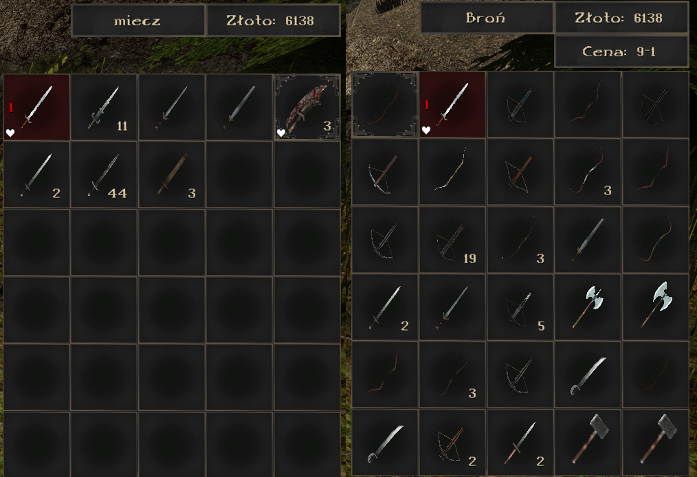

# CatInv-Union [Gothic 2 NotR]
A Union port of the popular CatInv (Categorized Inventory) plugin for Gothic II NotR, originally created by szapp (Sören Zapp) - visit [szapp's CatInv repository](https://github.com/szapp/CatInv) for the original Ninja version.
CatInv adds inventory categorization to Gothic II NotR, allowing players to filter items by type (weapons, armor, potions, etc.) for better inventory management. The main goal of the project is to eliminate the need for Ninja extension and add new functionalities not present in the original version.


https://www.youtube.com/watch?v=mbxLW37EjmA

## What's New in Union Version

This Union port includes several enhancements over the original Ninja CatInv:

- **Item Search** - Real-time search functionality with SHIFT+F, supporting diacritics and special characters
- **Recent Items Category** - Automatic tracking of recently acquired items (configurable via MaxRecentItems, default: 15), quick access with SHIFT+R
- **Favorites System** - Mark important items with = key (customizable in options menu), quick access with SHIFT+H, customizable heart icon
- **Jump to Real Category** - SHIFT+SPACE jumps from virtual categories (Search/Favorites/Recent) to the item's actual category, works across chests/merchants
- **Item Sorting** - Sort by price (9-1, 1-9) or name (A-Z, Z-A) with SHIFT+↑/↓
- **Locale-Aware Sorting** - Proper alphabetical sorting for all languages (Polish ą, German ö, etc.)
- **Configuration Menu** - In-game menu for adjusting settings without editing files, including customizable key bindings
- **Enhanced Navigation** - HOME/END keys for quick item jumping, wrap-around category cycling, custom category order
- **Improved Compatibility** - Better support for mods like The Chronicles of Myrtana: Archolos

## Features

- **11 Item Categories**: Favorites, Recent, All, Weapons, Armor, Magic, Artifacts, Food, Potions, Writings, Miscellaneous
- **Favorites System**: Mark items as favorites with = key, access anytime with SHIFT+H
- **Recent Items**: Automatically tracks recently acquired items (configurable, default: 15), access with SHIFT+R
- **Item Search**: Real-time search by item name with SHIFT+F (shown in category area)
- **Item Sorting**: Sort items by price or name with SHIFT+↑/↓ (shown below gold counter):
  - None (no indicator shown)
  - Price: 9-1 (expensive to cheap - descending)
  - Price: 1-9 (cheap to expensive - ascending)
  - Name: A-Z (alphabetical order)
  - Name: Z-A (reverse alphabetical)
- **Keyboard Navigation**: Use SHIFT + Arrow Keys to switch between categories
- **Category Wrap-Around**: Cycle through categories (from last to first and vice versa)
- **Custom Category Order**: Reorder or hide categories via INI configuration
- **Visual Category Display**: Shows current category name next to the gold counter
- **Visual Sort Display**: Shows current sort mode below the gold counter
- **Full Container Support**: Works with player inventory, chests, trade, and dead NPCs
- **Localization Support**: Automatically uses game language for category names and sort modes
- **Gothic II Compatible**: Supports Gothic II NotR

## Installation

1. Download the latest release from the [Releases](../../releases) page
2. Extract `CatInv.vdf` to your `Gothic II\Data\Plugins` folder
3. Launch Gothic II - the plugin will load automatically

## Usage

### Basic Controls
- **SHIFT + ←/→**: Switch between categories
- **SHIFT + ↓**: Cycle sort mode forward (None→Price 9-1→Price 1-9→Name A-Z→Name Z-A)
- **SHIFT + ↑**: Cycle sort mode backward (reverse order)
- **SHIFT + Home**: Jump to ALL category (reset filter)
- **SHIFT + End**: Jump to last category in custom order
- **SHIFT + H**: Jump to Favorites category
  - **= (Equals)**: Toggle favorite status for selected item (customizable in options menu)
- **SHIFT + R**: Jump to Recent items category (shows last acquired items)
- **SHIFT + Space**: Jump to item's real category (from Search/Favorites/Recent)
- **Home**: Jump to first item in current category/search results
- **End**: Jump to last item in current category/search results
- **SHIFT + F**: Activate item search
  - Type to search for items by name
  - **Enter/arrows**: Confirm search (allows navigation with arrows/Home/End)
  - **ESC**: Cancel search and return to category view
  - **Backspace**: Remove last character from search
  - **SHIFT + Backspace**: Clear entire search text
  - Search automatically switches to "All" category and is displayed in the category area

### Video
https://www.youtube.com/watch?v=mbxLW37EjmA

### Category Types
- **Favorites**: Shows only items marked as favorites (accessible with SHIFT+H)
- **Recent**: Shows recently acquired items in chronological order, newest first (configurable via MaxRecentItems, default: 15, accessible with SHIFT+R)
- **All**: Shows all items (default)
- **Weapons**: Melee weapons, bows, ammunition
- **Armor**: All types of armor and clothing
- **Magic**: Magical artifacts and special items
- **Artifacts**: Quest items and unique objects
- **Food**: All consumable food items
- **Potions**: Healing, mana, and other potions
- **Writings**: Books, letters, maps, and documents
- **Miscellaneous**: Tools, lights, and other items

## Configuration

```ini
[CATINV_UNION]
invCatChangeOnLast=1                ; 0=Stop at first/last category, 1=Wrap around categories (loop) - DEFAULT: 0 (OFF)
invCatHideFavorites=0               ; 0=Show Favorites in navigation, 1=Hide (accessible only via SHIFT+H)
invCatHideRecent=0                  ; 0=Show Recent items in navigation, 1=Hide
invCatOrder=FAVORITES,RECENT,ALL,COMBAT,ARMOR,RUNE,ARTIFACTS,FOOD,POTION,DOCS,OTHER  ; Custom category order
MaxRecentItems=15                   ; Number of items tracked in Recent category (min: 1, no upper limit) - DEFAULT: 15
FavoriteIconCorner=0                ; 0=Bottom-Left, 1=Bottom-Right, 2=Top-Left, 3=Top-Right
FavoriteIconSize=0                  ; 0=100%, 1=150%, 2=200%
KeyToggleFavorite=36                ; Key code for toggling favorites (36 = equals key) - configurable in options menu
```

### Options Explanation
- **invCatChangeOnLast**: When enabled (1), allows cycling through categories and sort modes - pressing SHIFT+→ on the last category will jump to the first category, and pressing SHIFT+↓ on the last sort mode (Name Z-A) will jump to the first sort mode (None). When disabled (0, default), navigation stops at boundaries.
- **invCatHideFavorites**: When enabled (1), hides the Favorites category from normal navigation (SHIFT+←/→). The category is still accessible via SHIFT+H shortcut
- **invCatHideRecent**: When enabled (1), hides the Recent items category from normal navigation (SHIFT+←/→)
- **invCatOrder**: Defines the order and visibility of categories. Categories can be:
  - **Reordered**: Change the sequence to your preference (e.g., put FOOD first)
  - **Hidden**: Remove categories you don't want to see (e.g., only show ALL/RECENT)
  - Supported names: FAVORITES, RECENT, ALL, COMBAT/WEAPON/WEAPONS, ARMOR, RUNE/MAGIC, ARTIFACT/ARTIFACTS, FOOD, POTION/POTIONS, DOCS/DOC/WRITINGS, OTHER/MISC/MISCELLANEOUS
  - Example: `invCatOrder=ALL,FOOD,POTION,COMBAT` (only shows 4 categories)
  - Note: SHIFT+HOME always jumps to ALL category (reset filter)
- **MaxRecentItems**: Controls how many items are tracked in the Recent category. Minimum: 1, no upper limit, default: 15. When reduced (e.g., from 15 to 5), only the newest items are kept. Setting this to 1 makes Recent show only the last acquired item. You can set it to any value like 20, 50, 100, or more.
- **FavoriteIconCorner**: Sets the position of the favorite heart icon on item frames
- **FavoriteIconSize**: Adjusts the size of the favorite heart icon (100%, 150%, or 200%)
- **KeyToggleFavorite**: Customizable key for toggling favorites. Can be changed in the options menu by clicking on "Toggle Favorite Key" option. Default is 36 (equals key =). Press ESC to cancel key binding.

## Building from Source

### Prerequisites
- Visual Studio 2019 or later
- Union SDK v1.0m

### Build Steps
1. Clone this repository
2. Copy ZenGin folder from Union SDK to `CatInv/ZenGin/`
3. Open `CatInv.sln` in Visual Studio
4. Select "G2A MT Release" configuration
5. Build the solution

## Credits

### Original Author
- **szapp (Sören Zapp)** - Original CatInv implementation for Gothic II
- Original project: [CatInv on GitHub](https://github.com/szapp/CatInv)

### Special Thanks
- **Union Team** - For the excellent Union SDK framework
- **Gothic Community** - For continued support and testing

## License

This project maintains compatibility with the original CatInv license terms.

## Compatibility

- **Gothic II Classic**: ✅ Supported
- **Gothic II NotR**: ✅ Supported
- **The Chronicles of Myrtana: Archolos**: ✅ Tested and working
- **Golden Gate II**: ✅ Tested and working
- **Other Plugins**: Compatible with most Union plugins

## Troubleshooting

### Plugin Not Loading
- Ensure `CatInv.vdf` is in the correct folder: `Gothic II\Data\Plugins`
- Check that Union is properly installed
- Verify Gothic II version compatibility

### Categories Not Working
- Make sure SHIFT key is held while pressing arrow keys
- Check that inventory is open when trying to switch categories

## Contributing

This is a community project. Feel free to:
- Report bugs in the [Issues](../../issues) section
- Submit improvements via Pull Requests
- Share feedback and suggestions
- Discord: raster96

## Version History

- **v1.0.3**
  - Improved compatibility with The Chronicles Of Myrtana: Archolos
  - Added Recent Items category (automatically tracks recently acquired items, configurable via MaxRecentItems, default: 15, access with SHIFT+R)
  - Added Favorites category (press = to add/remove item, SHIFT+H to access category)
  - Added Jump to Real Category feature (SHIFT+SPACE jumps from Search/Favorites/Recent to item's actual category):
    - Works in player inventory to jump between virtual and real categories
    - Works in chests/merchants to switch to player inventory and find the same item
    - Only switches if the item exists in player inventory
  - Added item sorting system with SHIFT+↑/↓:
    - Sort by price (descending/ascending)
    - Sort by name (A-Z/Z-A with proper diacritic character support)
    - Sort indicator shown below gold counter
  - Added configurable category order via invCatOrder INI option:
    - Reorder categories to your preference
    - Hide unwanted categories by removing them from the list
    - Custom order respected in navigation (SHIFT+←/→)
  - Added plugin menu with configurable options (invCatChangeOnLast, invCatHideFavorites, invCatHideRecent, FavoriteIconCorner, FavoriteIconSize)
  - Added key binding configuration in options menu - customize the "Toggle Favorite" key (default: =)
  - Changed default value of invCatChangeOnLast to 0 (off) - navigation stops at boundaries by default
  - Sorting works during search and persists across containers
  - Locale-aware string comparison for proper alphabetical sorting in all languages
  - Arrow keys now confirm search input (in addition to ENTER key)
  - SHIFT+HOME always jumps to ALL category (reset filter)
  - Fixed crash when removing items from dead bodies with active category/sorting
  - Fixed inventory closing when removing last item from filtered category
  - Improved timing for category/sort mode switching (matches item navigation speed)
  - Removed unused invCatG1Mode option

- **v1.0.2**
  - Fixed bug with unequipping stackable weapons
  - Bug fixes for scrolling and navigation issues
  - Fixed End key positioning and scrolling behavior
  - Fixed Home key container selection logic
  - Added proper scrolling support for filtered lists

- **v1.0.1**
  - Added item search functionality with SHIFT+F. Diacritics support copied from https://github.com/Sefaris/ItemMap/.
  - Added HOME/END keys to jump to first/last item in current view

- **v1.0.0** - Initial Union port
  - Full feature parity with original Ninja CatInv
  - Support for all container types
  - Localization support
  - Clean, optimized codebase

---

**Note**: This is an unofficial port. For the original Ninja version, visit [szapp's CatInv repository](https://github.com/szapp/CatInv).
